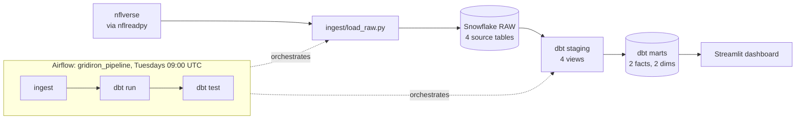

# Gridiron-Warehouse

An ELT pipeline over nflverse play-by-play data for the 2016–2024 NFL seasons.
Python pulls four nflverse datasets into Snowflake, dbt builds staging views and
analytics marts on top of them, Airflow (Astronomer Runtime) runs the whole chain
weekly, and a Streamlit dashboard reads the marts. The warehouse holds 435,483
plays, 162,833 player-game stat lines, 27,868 roster rows and 2,476 games.

## Architecture



Raw data lands in the `RAW` schema; dbt builds into `ANALYTICS`. The two are kept
separate so the ingest layer and the modelling layer never write to the same place.

## Data model

Staging is a thin pass over each source: light casting only, no business logic.
`stg_pbp` prunes play-by-play from 372 columns to the 51 used downstream; the other
three staging models pass their source through whole.

| Model | Grain | Scope |
|---|---|---|
| `fct_player_game` | one row per player per game (49,037) | offensive skill positions only — the grain comes from the passer/rusher/receiver ids on each play, so linemen and defenders have no row |
| `fct_team_game` | one row per team per game (4,952) | offense only, scrimmage plays (pass/run); a team's defensive performance is its opponent's row |
| `dim_player` | one row per player (8,755) | descriptive attributes from the player's most recent roster season; team excluded because it changes per season |
| `dim_team` | one row per team code (32) | codes as they appear in the facts; nflverse back-applies current codes to relocated franchises |

Two-point conversions are excluded from both facts, which is what makes counting
stats match official NFL totals.

## Testing

21 dbt tests run on every pipeline run:

| Category | Count | What it covers |
|---|---|---|
| Grain uniqueness | 2 | `dbt_utils.unique_combination_of_columns` on `(player_id, game_id)` and `(team, game_id)` |
| `not_null` | 6 | both facts' keys, both dims' primary keys |
| `relationships` | 3 | facts' `player_id` and `team` resolve to their dims |
| `accepted_values` | 2 | `stg_pbp.season_type`, `stg_schedules.game_type` |
| Value ranges | 4 | `dbt_utils.accepted_range` 0–1 on the four success-rate columns |
| Singular | 2 | `completions <= pass_attempts`, `receptions <= targets` |

`dbt test` exits non-zero if any test fails. The DAG's tasks run with `retries=0`
and the default `all_success` trigger rule, so a failing test fails its task and
the run, and a failure in `dbt run` means `dbt_test` never starts. Nothing
downstream consumes a build that did not pass.

## Findings

<!-- DRAFT: rewrite in own words -->

**Early-season team EPA predicts late-season EPA, but weakly, and with strong
regression to the mean.** Regressing each team-season's weeks 10+ EPA per play on
its weeks 1–9 EPA per play (OLS, n = 288 team-seasons, 2016–2024 regular season):

| | |
|---|---|
| Slope | 0.546 (95% CI 0.448–0.645) |
| R² | 0.293 |
| p-value | 2.5e-23 |
| n | 288 |

The relationship is real — highly significant, and residual diagnostics are clean.
But R² = 0.293 means early-season EPA explains only about 29% of the variation in
late-season EPA; the other 71% is injuries, schedule and noise.

The slope matters more than the significance. If early performance carried forward
one-for-one the slope would be 1.0. At 0.546, a team 0.10 EPA/play above average
through week 9 projects only 0.055 above average afterwards — about half of a hot
start is signal, half is noise. The confidence interval excludes 1.0.

## Engineering notes

<!-- DRAFT: rewrite in own words -->

**Ingest OOM in the container.** Loading nine seasons of play-by-play at once held
the Polars frame, its pandas copy and the parquet chunks in memory simultaneously,
peaking near 4.4 GB and getting SIGKILLed inside Airflow's 7.65 GB Docker
allocation. The loader now pulls one season at a time, overwriting the table on the
first season and appending the rest. Peak memory dropped to about 1.8 GB.

**Sparse string columns mistyped as numeric.** Loading season by season broke
Snowflake's type inference: 14 columns are entirely null in 2016 but hold strings
later, so `write_pandas` created them as `NUMBER` and the 2019 load failed on a
player id (`'00-0031285'`). An all-null Polars `String` column becomes `object` full
of `None` in pandas, which Snowflake reads as numeric. The fix casts columns by
their Polars dtype — not by name — so any future all-null string column is covered.

**dbt building into the wrong schema.** `profiles.yml` read the target schema from
`SNOWFLAKE_SCHEMA`, which the ingest layer legitimately sets to `RAW`. dbt built all
eight models into `RAW` alongside the source tables. The two concerns now use two
variables: `SNOWFLAKE_SCHEMA` for the ingest destination, `DBT_SCHEMA` for the dbt
target.

**Punt fumbles charged to the wrong team.** `fumble_lost` is a play-level flag
attributed to `posteam`, but on a punt `posteam` is the punting team while the
fumble is usually the returner's. 226 of 227 punt fumbles were misattributed.
`fct_team_game` now counts a lost fumble only when `fumbled_1_team = posteam`.

**Credentials baked into an image layer.** `.dockerignore` excluded `.env` but not
`.env.airflow`, so the Airflow image contained a file with real Snowflake values.
Both are now excluded; the file is injected at runtime instead.

**Dropbacks versus attempts.** nflverse's `pass_attempt` is a pass-*play* flag that
is 1 on sacks too, so it counts dropbacks, not official attempts — confirmed against
`RAW.PLAYER_STATS`, where mart attempts equal official attempts plus sacks for all
39 qualifying 2024 QBs. EPA per `pass_attempts` was therefore already EPA per
dropback, but completion percentage computed against it was wrong, and is now
divided by `pass_attempts - sacks`.

## Known limitations

<!-- DRAFT: rewrite in own words -->

**The ingest is idempotent but not atomic.** A rerun always produces the same
result, but a load that dies partway leaves `RAW.PBP` holding only the seasons
written so far — the first season's `overwrite=True` has already replaced the table.
This has happened: a scheduled run died mid-load and left six of nine seasons. The
fail-fast DAG chain contained it, since `dbt run` never started and the marts kept
their last good state, but the raw layer was inconsistent until reloaded. Staging to
a temporary table and swapping it in at the end would make the load atomic.

**The schedule runs on a laptop.** The weekly DAG only fires if the machine is awake
and Docker is running. One scheduled run was killed by SIGTERM when the machine
slept mid-load on battery, which is also why that run took 100 minutes instead of
the usual 5.5. A hosted scheduler would remove this entirely.

## Running locally

Prerequisites: Python 3.13, [uv](https://docs.astral.sh/uv/), a Snowflake account
with key-pair auth configured, Docker, and the
[Astro CLI](https://www.astronomer.io/docs/astro/cli/overview) for the Airflow
parts.

```bash
uv sync
```

Credentials come from two files at the repo root, neither committed:

- **`.env`** — used by the ingest script, local dbt runs and the dashboard.
  `SNOWFLAKE_ACCOUNT`, `SNOWFLAKE_USER`, `SNOWFLAKE_PRIVATE_KEY_PATH`,
  `SNOWFLAKE_ROLE`, `SNOWFLAKE_WAREHOUSE`, `SNOWFLAKE_DATABASE`, `SNOWFLAKE_SCHEMA`.
- **`.env.airflow`** — the same seven variables for the containers, with
  `SNOWFLAKE_PRIVATE_KEY_PATH` pointing at the in-container mount
  (`/usr/local/airflow/keys/nfl_rsa_key.p8`) instead of the host path, plus
  `DBT_SCHEMA=ANALYTICS`.

The split exists because the key lives at a different path inside the container, and
because dbt's target schema must not follow the ingest layer's.

```bash
# load all four sources into RAW (~6 minutes)
uv run python ingest/load_raw.py

# build and test the models (needs the .env vars exported)
cd dbt/gridiron && uv run dbt deps && uv run dbt run && uv run dbt test

# Airflow, from the repo root — the --env flag is required
astro dev start --env .env.airflow

# dashboard
uv run streamlit run dashboard/app.py
```

The Airflow UI is at `http://localhost:8080`; the DAG is `gridiron_pipeline`,
scheduled `0 9 * * 2` (Tuesdays 09:00 UTC) with `catchup=False` and
`max_active_runs=1`.

## Attribution

Code in this repository is MIT licensed — see [LICENSE](LICENSE).

Data from [nflverse](https://github.com/nflverse), used under CC-BY 4.0. No
nflverse data is stored in this repository; `ingest/load_raw.py` downloads it at
runtime.
