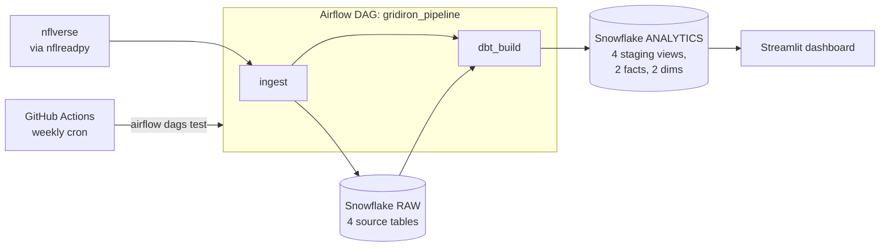

# Gridiron-Warehouse

An ELT pipeline over nflverse play-by-play data, from the 2014 NFL season through
the current one, refreshed weekly. Python pulls four nflverse datasets into
Snowflake, dbt builds staging views and analytics marts on top of them, an Airflow
DAG runs the chain on a weekly GitHub Actions schedule, and a Streamlit dashboard
reads the marts. As of September 30, 2026 the warehouse holds about 851K rows;
play-by-play alone is 588K. Counts grow each week as the current season is played.

## Architecture


```mermaid
flowchart LR
    GHA[GitHub Actions<br/>weekly cron] -->|airflow dags test| AF
    subgraph AF [Airflow DAG: gridiron_pipeline]
        direction LR
        T1[ingest] --> T2[dbt_build]
    end
    NV[nflverse<br/>via nflreadpy] --> T1
    T1 --> RAW[(Snowflake RAW<br/>4 source tables)]
    RAW --> T2
    T2 --> MARTS[(Snowflake ANALYTICS<br/>4 staging views,<br/>2 facts, 2 dims)]
    MARTS --> APP[Streamlit dashboard]
```

Raw data lands in the `RAW` schema; dbt builds into `ANALYTICS`. The two are kept
separate so the ingest layer and the modelling layer never write to the same place.

The weekly run happens on GitHub Actions: the workflow builds the Astro Runtime
image and executes the DAG in it with `airflow dags test`. Astro (`astro dev`) is
the local development environment for the same image and DAG.

## Data model

Staging is a thin pass over each source: light casting only, no business logic.
`stg_pbp` prunes play-by-play from 372 columns to the 51 used downstream; the other
three staging models pass their source through whole.

Row counts as of September 30, 2026:

| Model | Grain | Scope |
|---|---|---|
| `fct_player_game` | one row per player per game (66,255) | offensive skill positions only — the grain comes from the passer/rusher/receiver ids on each play, so linemen and defenders have no row |
| `fct_team_game` | one row per team per game (6,686) | offense only, scrimmage plays (pass/run); a team's defensive performance is its opponent's row |
| `dim_player` | one row per player (10,593) | descriptive attributes from the player's most recent roster season; team excluded because it changes per season |
| `dim_team` | one row per team code (32) | codes as they appear in the facts; nflverse back-applies current codes to relocated franchises |

Two-point conversions are excluded from both facts, which is what makes counting
stats match official NFL totals.

## Testing

21 dbt tests run on every pipeline run:

| Category | Count | What it covers |
|---|---|---|
| Grain uniqueness | 2 | `dbt_utils.unique_combination_of_columns` on `(player_id, game_id)` and `(team, game_id)` |
| `not_null` | 6 | both facts' keys, both dims' primary keys |
| `relationships` | 3 | facts' `player_id` and `team` resolve to their dims |
| `accepted_values` | 2 | `stg_pbp.season_type`, `stg_schedules.game_type` |
| Value ranges | 4 | `dbt_utils.accepted_range` 0–1 on the four success-rate columns |
| Singular | 2 | `completions <= pass_attempts`, `receptions <= targets` |

The DAG runs `dbt build`, which tests each model before building its dependents.
A failed test skips everything downstream of it, so those marts keep their last good
version instead of being rebuilt on bad data. The task then exits non-zero, which
fails the DAG run and the workflow.

This was checked with a deliberately failing test attached to `stg_pbp`.
`fct_player_game`, `fct_team_game` and `dim_team` — everything downstream of
`stg_pbp` — were skipped, and their `last_altered` timestamps were unchanged to the
millisecond. `dim_player`, which depends only on `stg_rosters`, still built.

## Findings

**Early-season team EPA predicts late-season EPA, but weakly, and with strong
regression to the mean.** Regressing each team-season's weeks 10+ EPA per play on
its weeks 1–9 EPA per play (OLS, regular season). The current season is excluded
until it has at least 3 games in the late window.

| | |
|---|---|
| n | 384 team-seasons (2014–2025) |
| Slope | 0.548 (95% CI 0.458–0.638) |
| R² | 0.273 |
| p-value | 3.0e-28 |

The relationship is real — highly significant, and residual diagnostics are clean.
But R² = 0.273 means early-season EPA explains only about 27% of the variation in
late-season EPA; the other 73% is injuries, schedule and noise.

The slope matters more than the significance. If early performance carried forward
one-for-one the slope would be 1.0. At 0.548, a team 0.10 EPA/play above average
through week 9 projects only 0.055 above average afterwards — about half of a hot
start is signal, half is noise. The confidence interval excludes 1.0.

## Engineering notes

**Ingest OOM in the container.** Loading nine seasons of play-by-play at once held
the Polars frame, its pandas copy and the parquet chunks in memory simultaneously,
peaking near 4.4 GB and getting SIGKILLed inside Airflow's 7.65 GB Docker
allocation. The loader now pulls one season at a time, overwriting the table on the
first season and appending the rest. Peak memory dropped to about 1.8 GB.

**Sparse string columns mistyped as numeric.** Loading season by season broke
Snowflake's type inference: 14 columns are entirely null in 2016 but hold strings
later, so `write_pandas` created them as `NUMBER` and the 2019 load failed on a
player id (`'00-0031285'`). An all-null Polars `String` column becomes `object` full
of `None` in pandas, which Snowflake reads as numeric. The fix casts columns by
their Polars dtype — not by name — so any future all-null string column is covered.

**dbt building into the wrong schema.** `profiles.yml` read the target schema from
`SNOWFLAKE_SCHEMA`, which the ingest layer legitimately sets to `RAW`. dbt built all
eight models into `RAW` alongside the source tables. The two concerns now use two
variables: `SNOWFLAKE_SCHEMA` for the ingest destination, `DBT_SCHEMA` for the dbt
target.

**Punt fumbles charged to the wrong team.** `fumble_lost` is a play-level flag
attributed to `posteam`, but on a punt `posteam` is the punting team while the
fumble is usually the returner's. 226 of 227 punt fumbles were misattributed.
`fct_team_game` now counts a lost fumble only when `fumbled_1_team = posteam`.

**Credentials baked into an image layer.** `.dockerignore` excluded `.env` but not
`.env.airflow`, so the Airflow image contained a file with real Snowflake values.
Both are now excluded; the file is injected at runtime instead.

**Dropbacks versus attempts.** nflverse's `pass_attempt` is a pass-*play* flag that
is 1 on sacks too, so it counts dropbacks, not official attempts — confirmed against
`RAW.PLAYER_STATS`, where mart attempts equal official attempts plus sacks for all
39 QBs with 200+ dropbacks in 2024. EPA per `pass_attempts` was therefore already
EPA per dropback, but completion percentage computed against it was wrong, and is
now divided by `pass_attempts - sacks`.

**Abbreviated player names collide.** nflverse's play-by-play gives passers
abbreviated names like `J.Daniels`, and in 2026 two different players share that
one, so grouping by name merged another player's 3 attempts into Jayden Daniels'
line. Six season-name pairs collide across the data. The QB view now groups passers by
`player_id` and only displays the name.

**`dbt run` then `dbt test` became `dbt build`.** With separate steps, every model
was rebuilt before any test ran, so a failing test reported bad data that the marts
already contained. `dbt build` tests each model before its dependents, so a failure
stops the bad data before it reaches the marts.

## Known limitations

**The ingest is idempotent but not atomic.** A rerun always produces the same
result, but a load that dies partway leaves `RAW.PBP` holding only the seasons
written so far — the first season's `overwrite=True` has already replaced the table.
This has happened: a scheduled run died mid-load and left six of nine seasons. The
DAG contained it, since the dbt task never started and the marts kept their last
good state, but the raw layer was inconsistent until reloaded. Staging to a
temporary table and swapping it in at the end would make the load atomic.

**`dbt build` protects only what is downstream of a failed test.** The model whose
test fails has already been rebuilt by the time its test runs, so it holds the bad
data; only its dependents are spared. A write-audit-publish pattern — build into a
staging schema, test there, then swap — would protect the failing model too.

**The trigger is GitHub's cron, not a running Airflow scheduler.** GitHub Actions
starts the workflow, which executes the DAG once with `airflow dags test`. There is
no long-lived scheduler, so Airflow features that depend on one, such as the DAG's
own `schedule`, sensors or a persistent run history, do not apply to the weekly run.

**GitHub disables scheduled workflows after 60 days without repository activity.**
If the repo goes quiet for two months, the weekly run stops until the workflow is
re-enabled or a commit is pushed.

## Running locally

Prerequisites: Python 3.13, [uv](https://docs.astral.sh/uv/), a Snowflake account
with key-pair auth configured, Docker, and the
[Astro CLI](https://www.astronomer.io/docs/astro/cli/overview) for the Airflow
parts.

```bash
uv sync
```

Credentials come from two files at the repo root, neither committed:

- **`.env`** — used by the ingest script, local dbt runs and the dashboard.
  `SNOWFLAKE_ACCOUNT`, `SNOWFLAKE_USER`, `SNOWFLAKE_PRIVATE_KEY_PATH`,
  `SNOWFLAKE_ROLE`, `SNOWFLAKE_WAREHOUSE`, `SNOWFLAKE_DATABASE`, `SNOWFLAKE_SCHEMA`.
- **`.env.airflow`** — the same seven variables for the containers, with
  `SNOWFLAKE_PRIVATE_KEY_PATH` pointing at the in-container mount
  (`/usr/local/airflow/keys/nfl_rsa_key.p8`) instead of the host path, plus
  `DBT_SCHEMA=ANALYTICS`.

The split exists because the key lives at a different path inside the container, and
because dbt's target schema must not follow the ingest layer's.

```bash
# load 2014 through the current season into RAW
uv run python ingest/load_raw.py

# build and test the models (needs the .env vars exported)
cd dbt/gridiron && uv run dbt deps && uv run dbt build

# Airflow, from the repo root — the --env flag is required
astro dev start --env .env.airflow

# dashboard
uv run streamlit run dashboard/app.py
```

The Airflow UI is at `http://localhost:8080`; the DAG is `gridiron_pipeline`. Keep
it paused in the local stack — the weekly run comes from GitHub Actions, and an
unpaused local copy would run the pipeline a second time.

### GitHub Actions

`.github/workflows/weekly-pipeline.yml` runs the DAG every Tuesday at 13:00 UTC
(`0 13 * * 2`), or on demand. It needs three repository secrets under
**Settings → Secrets and variables → Actions**:

- `SNOWFLAKE_ACCOUNT`
- `SNOWFLAKE_USER`
- `SNOWFLAKE_PRIVATE_KEY` — the full contents of the private key file

The role, warehouse, database and both schemas are plain values in the workflow.
To run it on demand:

```bash
gh workflow run weekly-pipeline.yml
```

## Attribution

Code in this repository is MIT licensed — see [LICENSE](LICENSE).

Data from [nflverse](https://github.com/nflverse), used under CC-BY 4.0. No
nflverse data is stored in this repository; `ingest/load_raw.py` downloads it at
runtime.
